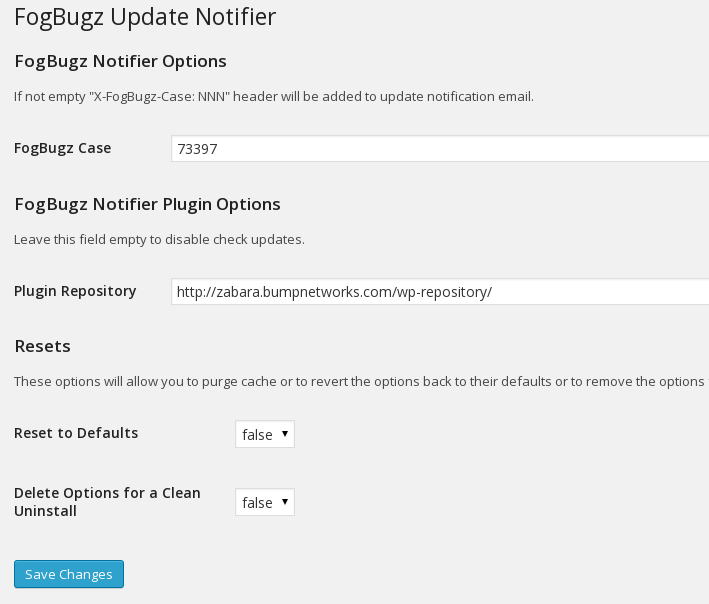

# FogBugz Update Notifier Plugin

This plugin is an add-on to "WP Updates Notifier" plugin by Scott Cariss. It allows to add 
"X-FogBugz-Case" extra header to notification email. The purpose is to automate FogBugz case creation process.

### Installation

1. Upload `wp-fogbugz-notifier` to the `/wp-content/plugins/`  directory
2. Activate the plugin through the 'Plugins' menu in WordPress
3. Configure 'FogBugz Case' option (the case number where update notification will be placed).
4. Configure 'Plugin Repository' to check plugin updates or leave it empty to disable this feature

### Screenshots

